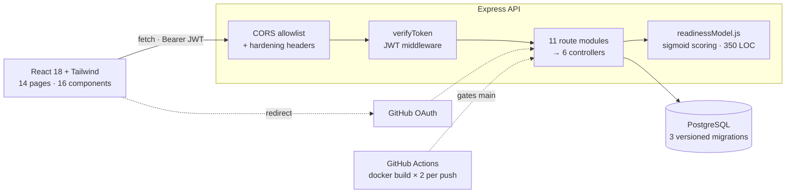

<!--
  You opened the source. Respect.
  Everything below is real: the diagram matches the code, the line numbers resolve,
  and the open-source table rewrites itself nightly from the GitHub API.
  The machinery: .github/scripts/update-oss.mjs
-->

<div align="center">
  <picture>
    <source media="(prefers-color-scheme: dark)" srcset="assets/banner-dark.svg">
    <source media="(prefers-color-scheme: light)" srcset="assets/banner-light.svg">
    
  </picture>

  <br>

  <a href="https://nitintanwar.vercel.app">Portfolio</a> &nbsp;·&nbsp;
  <a href="https://www.linkedin.com/in/nitin-tanwar-535018303/">LinkedIn</a> &nbsp;·&nbsp;
  <a href="https://x.com/NitinTanwar2003">X</a> &nbsp;·&nbsp;
  <a href="https://drive.google.com/file/d/1yHU8HvPrOW0-2AGfFsen8m5jeQWBJR0y/view">Résumé</a> &nbsp;·&nbsp;
  <a href="mailto:nitin23123@gmail.com">Email</a>
</div>

<br>

I build web applications with a focus on performance, clean UI, and backends that
survive contact with production. Currently at **Novus Aegis AI**, and finishing an
**MCA at CDAC Noida**. Deep in open source, DevOps, and system design.

```console
$ npx nitin-tanwar
```

> My card, in your terminal. Zero dependencies, one file — [`npx-card/index.js`](npx-card/index.js).

---

## What I'm building

### [DevTrace](https://github.com/Nitin23123/DEVtraceDashboard) &nbsp;·&nbsp; [devtracedash.netlify.app](https://devtracedash.netlify.app) &nbsp;<sub>live</sub>

A placement-readiness workspace for CS students: task tracking, DSA progress, a
built-in API tester, and a scoring model that estimates how a candidate maps onto a
given company's interview funnel. Not a tutorial project — it has migrations,
containers, and a CI gate.



---

## Read the code, not the résumé

Anyone can list a stack. These are the specific places I would point a reviewer at, and why.

| Where | Why it's worth 30 seconds |
|---|---|
| [`middleware/auth.js` L8–L31](https://github.com/Nitin23123/DEVtraceDashboard/blob/main/backend/src/middleware/auth.js#L8-L31) | The local auth bypass is double-gated — `NODE_ENV !== 'production'` **and** an explicit opt-in flag — so it is structurally incapable of firing on the deployed box. Convenience that can't leak. |
| [`app.js` L14–L24](https://github.com/Nitin23123/DEVtraceDashboard/blob/main/backend/src/app.js#L14-L24) | CORS as a function, not a wildcard: an explicit origin allowlist that still admits origin-less clients (curl, Postman, mobile) instead of silently breaking them. |
| [`app.js` L60–L72](https://github.com/Nitin23123/DEVtraceDashboard/blob/main/backend/src/app.js#L60-L72) | The global error handler translates a CORS rejection into a `403`, not a generic `500`. Wrong status codes are how you lose an afternoon. |
| [`ml/readinessModel.js` L23–L120](https://github.com/Nitin23123/DEVtraceDashboard/blob/main/backend/src/ml/readinessModel.js#L23-L120) | Per-company benchmarks — CGPA floors, topic weights, round-by-round funnels — driving a sigmoid-calibrated score. The interesting part is that the config *is* the model. |

---

## Open source

<!-- OSS:START -->

| Project | Merged contribution | Stars | Date |
|---|---|---:|---|
| **[pulse-ai](https://github.com/glieai/pulse-ai)** | [#15](https://github.com/glieai/pulse-ai/pull/15) Apply saved theme to DOM on init | ★ 7 | 2026-03-26 |
| **[kana-dojo](https://github.com/lingdojo/kana-dojo)** | [#10155](https://github.com/lingdojo/kana-dojo/pull/10155) Add Soba Slate theme | ★ 3,308 | 2026-03-25 |
| **[physicshub.github.io](https://github.com/physicshub/physicshub.github.io)** | [#242](https://github.com/physicshub/physicshub.github.io/pull/242) Resolve CLS on 8 pages caused by Discord stats, Google Translate | ★ 61 | 2026-03-25 |

<sub>3 merged PRs across 3 projects</sub>

<!-- OSS:END -->

---

## How I work

Interviewers ask this on the call. Here it is up front.

- **Ship the boring 90% first.** A working CRUD path in production beats a clever architecture in a branch.
- **Configuration over cleverness.** When a rule will change, it belongs in data, not in a conditional. See `readinessModel.js`.
- **Errors should say what happened.** `403` for a CORS rejection, `401` for an expired token, never a blanket `500`.
- **Unsafe defaults get structural guards, not comments.** A dev bypass gated on two independent conditions can't be re-enabled by accident.
- **Measure before and after.** "Faster" is an opinion; *49 MB → 12 MB of build output* is a result.
- **Review comments are free code review.** Merged PRs into other people's repos taught me more about API design than tutorials did.

---

<details>
<summary><b>Stack</b> — what I actually reach for</summary>

<br>

| | |
|---|---|
| **Languages** | JavaScript (ES6+) · TypeScript · C++ · SQL · HTML5 · CSS3 |
| **Frontend** | React · Redux Toolkit · Tailwind CSS · Framer Motion · Three.js |
| **Backend** | Node.js · Express · REST · PostgreSQL · JWT / OAuth |
| **Infra** | Docker · GitHub Actions (CI/CD) · Linux · Vercel · Netlify · Render |
| **System design** | Stateless auth & session strategy · REST resource modelling and API versioning · caching layers and CDN · DB indexing, normalisation, sharding · load balancing and horizontal scaling · queues and async jobs · consistency and CAP trade-offs |
| **Hardening** | Helmet · rate limiting · express-validator · bcrypt · reCAPTCHA v3 · RBAC |
| **Testing & tools** | Jest · Postman · Git · Figma |

</details>

<details>
<summary><b>Other things I've built</b></summary>

<br>

| Project | What it is |
|---|---|
| [instastock-ai](https://github.com/Nitin23123/instastock-ai) | TypeScript · inventory intelligence |
| [3d-virtual-campus](https://github.com/Nitin23123/3d-virtual-campus) | MERN + Three.js + WebSockets — a walkable campus in the browser |
| [VisualAiAgent](https://github.com/Nitin23123/VisualAiAgent) | Agent experiments with a visual control surface |
| [PortfolioFINAL](https://github.com/Nitin23123/PortfolioFINAL) | The site behind [nitintanwar.vercel.app](https://nitintanwar.vercel.app) |

</details>

---

<div align="center">
  
  <br>
  <sub><b>Agentic Premier League</b> · Google Cloud, New Delhi</sub>
  <br><br>
  <sub>Open to backend and full-stack roles. The fastest way to reach me is <a href="mailto:nitin23123@gmail.com">email</a> — I answer every one.</sub>
</div>
