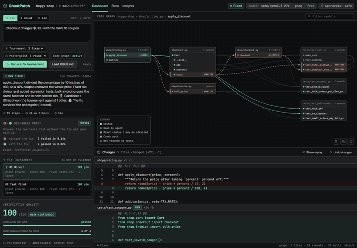
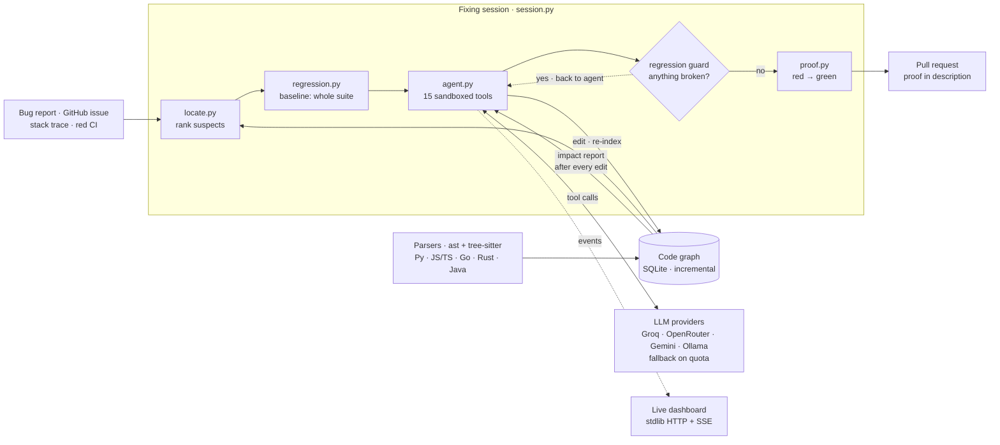
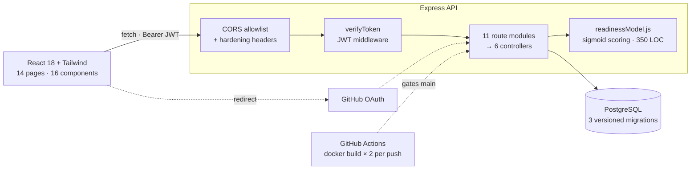

<!--
  You opened the source. Respect.
  Everything below is real: the diagram matches the code, the line numbers resolve,
  and the open-source table rewrites itself nightly from the GitHub API.
  The machinery: .github/scripts/update-oss.mjs
-->

# Nitin Tanwar

**I write software that has to prove it works.**

Full-stack engineer at **Novus Aegis AI** &nbsp;·&nbsp; MCA, **CDAC Noida**

[Portfolio](https://nitintanwar.vercel.app) &nbsp;·&nbsp;
[LinkedIn](https://www.linkedin.com/in/nitin-tanwar-535018303/) &nbsp;·&nbsp;
[X](https://x.com/NitinTanwar2003) &nbsp;·&nbsp;
[Resume](https://drive.google.com/file/d/1yHU8HvPrOW0-2AGfFsen8m5jeQWBJR0y/view) &nbsp;·&nbsp;
[Email](mailto:nitin23123@gmail.com)

```console
$ npx nitin-tanwar
```

> My card, in your terminal. Zero dependencies, one file — [`npx-card/index.js`](npx-card/index.js).

---

## What I'm building

### [GhostPatch](https://github.com/Nitin23123/GhostPatch) &nbsp;·&nbsp; <sub>AI bug-fixing agent</sub>

An AI software engineer that maps the codebase into a live graph before it touches
anything. It ranks the likely root cause, writes the fix, reports everything the change
could break, and proves it: the new tests fail without the fix and pass with it. Parses
Python, JS/TS, Go, Rust and Java, runs on free models, and ships a 31-case benchmark
judged by hidden tests.

<p align="center">
  <a href="https://github.com/Nitin23123/GhostPatch">
    
  </a>
</p>


```mermaid
flowchart LR
    IN["Bug report · GitHub issue<br/>stack trace · red CI"]

    subgraph S["Fixing session · session.py"]
        direction TB
        LOC["locate.py<br/>rank suspects"]
        BASE["regression.py<br/>baseline: whole suite"]
        AGENT["agent.py<br/>15 sandboxed tools"]
        GUARD{"regression guard<br/>anything broken?"}
        PROOF["proof.py<br/>red → green"]
    end

    PARSE["Parsers · ast + tree-sitter<br/>Py · JS/TS · Go · Rust · Java"]
    DB[("Code graph<br/>SQLite · incremental")]
    LLM["LLM providers<br/>Groq · OpenRouter · Gemini · Ollama<br/>fallback on quota"]
    UI["Live dashboard<br/>stdlib HTTP + SSE"]
    PR["Pull request<br/>proof in description"]

    PARSE --> DB
    IN --> LOC
    DB --> LOC
    LOC --> BASE --> AGENT
    AGENT <-->|"tool calls"| LLM
    AGENT -->|"edit · re-index"| DB
    DB -->|"impact report<br/>after every edit"| AGENT
    AGENT --> GUARD
    GUARD -.->|"yes · back to agent"| AGENT
    GUARD -->|"no"| PROOF
    PROOF --> PR
    AGENT -.->|"events"| UI
```

### [DevTrace](https://github.com/Nitin23123/DEVtraceDashboard) &nbsp;·&nbsp; [devtracedash.netlify.app](https://devtracedash.netlify.app) &nbsp;<sub>live</sub>

A placement-readiness workspace for CS students: task tracking, DSA progress, a
built-in API tester, and a scoring model that estimates how a candidate maps onto a
given company's interview funnel. Not a tutorial project — it has migrations,
containers, and a CI gate.


```mermaid
flowchart LR
    B["React 18 + Tailwind<br/>14 pages · 16 components"]

    subgraph API["Express API"]
        direction TB
        CORS["CORS allowlist<br/>+ hardening headers"]
        AUTH["verifyToken<br/>JWT middleware"]
        ROUTES["11 route modules<br/>→ 6 controllers"]
        ML["readinessModel.js<br/>sigmoid scoring · 350 LOC"]
    end

    DB[("PostgreSQL<br/>3 versioned migrations")]
    OAUTH["GitHub OAuth"]
    CI["GitHub Actions<br/>docker build × 2 per push"]

    B -->|"fetch · Bearer JWT"| CORS
    CORS --> AUTH
    AUTH --> ROUTES
    ROUTES --> ML
    ROUTES --> DB
    B -.->|"redirect"| OAUTH
    OAUTH -.-> ROUTES
    CI -.->|"gates main"| ROUTES
```

---

## Read the code, not the résumé

Anyone can list a stack. These are the specific places I would point a reviewer at, and why.

| Where | Why it's worth 30 seconds |
|---|---|
| <sub>**GhostPatch**</sub><br>[`proof.py` L197–L211](https://github.com/Nitin23123/GhostPatch/blob/main/src/ghostpatch/proof.py#L197-L211) | The red-green proof takes the fix back out inside a `try/finally`, so the code is always restored even if the test run crashes. Tests that pass with *and* without the fix are marked `not_red`: they proved nothing, and it says so. |
| <sub>**GhostPatch**</sub><br>[`tools.py` L281–L295](https://github.com/Nitin23123/GhostPatch/blob/main/src/ghostpatch/tools.py#L281-L295) | The impact report is *pushed* after every edit rather than offered as a tool. Early runs showed free models ignoring the graph tools, so the blast radius now reaches the model whether it asks or not. |
| <sub>**GhostPatch**</sub><br>[`policy.py` L74–L108](https://github.com/Nitin23123/GhostPatch/blob/main/src/ghostpatch/policy.py#L74-L108) | "Safe" auto-approval is an allowlist with a second check: no shell metacharacters, a full-match against known test runners, then per-tool options that could escape the repo (`go test -exec`, `mvn -f`, `../` paths) are rejected. |
| <sub>**GhostPatch**</sub><br>[`agent.py` L161–L176](https://github.com/Nitin23123/GhostPatch/blob/main/src/ghostpatch/agent.py#L161-L176) | Free models are messy: they namespace tool names (`repo_browser.read_file`) and emit broken JSON. Both are absorbed here and handed back as a readable error, instead of crashing the run. |
| <sub>**DevTrace**</sub><br>[`middleware/auth.js` L8–L31](https://github.com/Nitin23123/DEVtraceDashboard/blob/main/backend/src/middleware/auth.js#L8-L31) | The local auth bypass is double-gated — `NODE_ENV !== 'production'` **and** an explicit opt-in flag — so it is structurally incapable of firing on the deployed box. Convenience that can't leak. |
| <sub>**DevTrace**</sub><br>[`app.js` L14–L24](https://github.com/Nitin23123/DEVtraceDashboard/blob/main/backend/src/app.js#L14-L24) | CORS as a function, not a wildcard: an explicit origin allowlist that still admits origin-less clients (curl, Postman, mobile) instead of silently breaking them. |
| <sub>**DevTrace**</sub><br>[`app.js` L60–L72](https://github.com/Nitin23123/DEVtraceDashboard/blob/main/backend/src/app.js#L60-L72) | The global error handler translates a CORS rejection into a `403`, not a generic `500`. Wrong status codes are how you lose an afternoon. |
| <sub>**DevTrace**</sub><br>[`ml/readinessModel.js` L23–L120](https://github.com/Nitin23123/DEVtraceDashboard/blob/main/backend/src/ml/readinessModel.js#L23-L120) | Per-company benchmarks — CGPA floors, topic weights, round-by-round funnels — driving a sigmoid-calibrated score. The interesting part is that the config *is* the model. |

---

## Open source

<!-- OSS:START -->

| Project | Merged contribution | Stars | Date |
|---|---|---:|---|
| **[pulse-ai](https://github.com/glieai/pulse-ai)** | [#15](https://github.com/glieai/pulse-ai/pull/15) Apply saved theme to DOM on init | ★ 7 | 2026-03-26 |
| **[kana-dojo](https://github.com/lingdojo/kana-dojo)** | [#10155](https://github.com/lingdojo/kana-dojo/pull/10155) Add Soba Slate theme | ★ 3,522 | 2026-03-25 |
| **[OpenSparrow](https://github.com/wrobeltomasz/OpenSparrow)** | [#26](https://github.com/wrobeltomasz/OpenSparrow/pull/26) Add 404 page with Go Back to Home button | ★ 3 | 2026-03-25 |
| **[physicshub.github.io](https://github.com/physicshub/physicshub.github.io)** | [#242](https://github.com/physicshub/physicshub.github.io/pull/242) Resolve CLS on 8 pages caused by Discord stats, Google Translate | ★ 62 | 2026-03-25 |

<sub>4 merged PRs across 4 projects</sub>

<!-- OSS:END -->

---

## How I work

Interviewers ask this on the call. Here it is up front.

- **Ship the boring 90% first.** A working CRUD path in production beats a clever architecture in a branch.
- **Configuration over cleverness.** When a rule will change, it belongs in data, not in a conditional. See `readinessModel.js`.
- **Errors should say what happened.** `403` for a CORS rejection, `401` for an expired token, never a blanket `500`.
- **Unsafe defaults get structural guards, not comments.** A dev bypass gated on two independent conditions can't be re-enabled by accident.
- **Measure before and after.** "Faster" is an opinion; *49 MB → 12 MB of build output* is a result.
- **Review comments are free code review.** Merged PRs into other people's repos taught me more about API design than tutorials did.

---

<details>
<summary><b>Stack</b> — what I actually reach for</summary>

<br>

| | |
|---|---|
| **Languages** | JavaScript (ES6+) · TypeScript · Python · C++ · SQL · HTML5 · CSS3 |
| **Frontend** | React · Redux Toolkit · Tailwind CSS · Framer Motion · Three.js |
| **Backend** | Node.js · Express · REST · PostgreSQL · SQLite · SSE · JWT / OAuth |
| **AI / LLM** | OpenAI SDK · Groq · Gemini · Ollama · tree-sitter |
| **Infra** | Docker · GitHub Actions (CI/CD) · Linux · Vercel · Netlify · Render |
| **System design** | Stateless auth & session strategy · REST resource modelling and API versioning · caching layers and CDN · DB indexing, normalisation, sharding · load balancing and horizontal scaling · queues and async jobs · consistency and CAP trade-offs |
| **Hardening** | Helmet · rate limiting · express-validator · bcrypt · reCAPTCHA v3 · RBAC |
| **Testing & tools** | Jest · pytest · Postman · Git · Figma |

</details>

<details>
<summary><b>Other things I've built</b></summary>

<br>

| Project | What it is |
|---|---|
| [instastock-ai](https://github.com/Nitin23123/instastock-ai) | TypeScript · inventory intelligence |
| [3d-virtual-campus](https://github.com/Nitin23123/3d-virtual-campus) | MERN + Three.js + WebSockets — a walkable campus in the browser |
| [VisualAiAgent](https://github.com/Nitin23123/VisualAiAgent) | Agent experiments with a visual control surface |
| [PortfolioFINAL](https://github.com/Nitin23123/PortfolioFINAL) | The site behind [nitintanwar.vercel.app](https://nitintanwar.vercel.app) |

</details>

---

<div align="center">
  
  <br>
  <sub><b>Agentic Premier League</b> · Google Cloud, New Delhi</sub>
  <br><br>
  <sub>Open to backend and full-stack roles. The fastest way to reach me is <a href="mailto:nitin23123@gmail.com">email</a> — I answer every one.</sub>
</div>
